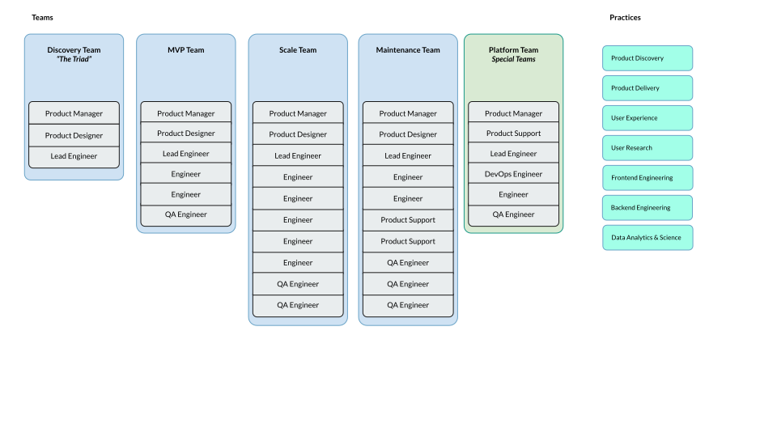
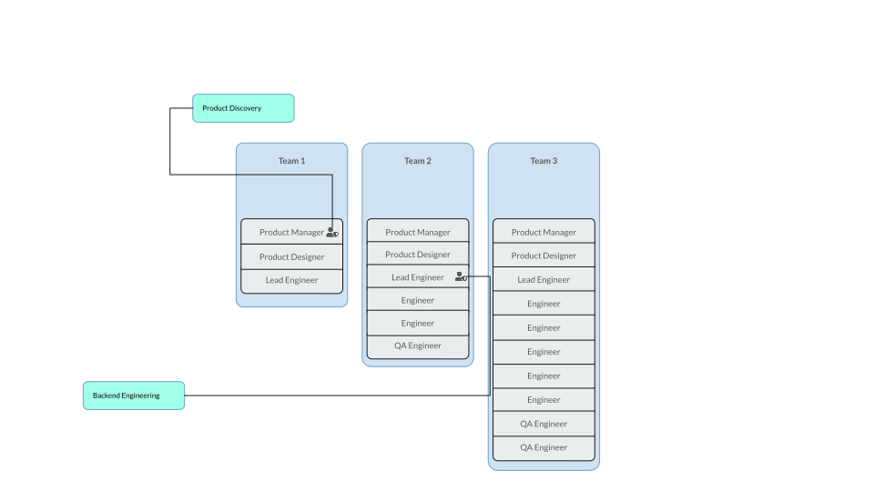

## Best Practices

## How to manage uneven skills across teams

The reality is, you probably don’t have a team with similar experience everywhere, and sometimes a team member has unique specialty built 

### Pros  
Durable, focused on a business outcome for multiple iterations  
Supports expansion as outcome expands  
Sets clear capacity with leadership

### Cons  
Sr. more specialized team members are less clear how they fit in  
Can more sr. People not feel,like they have enough sphere of influence

## Practices
Practice leaders are responsible for honing the craft of a particular functional specialty across the team members. Practice leaders should have specific goals and outcomes outside of their team goals.

